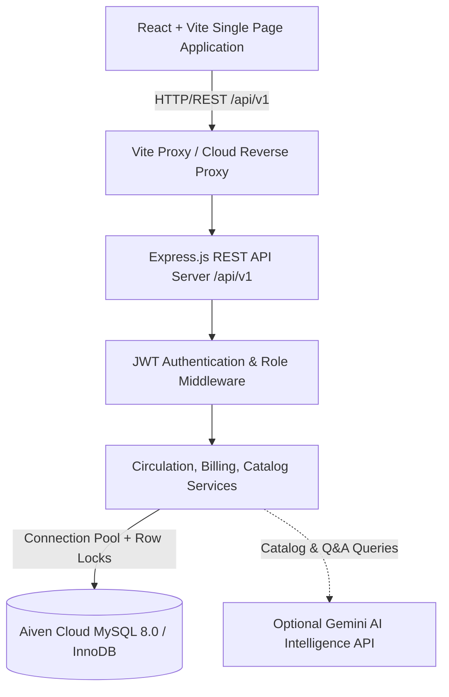
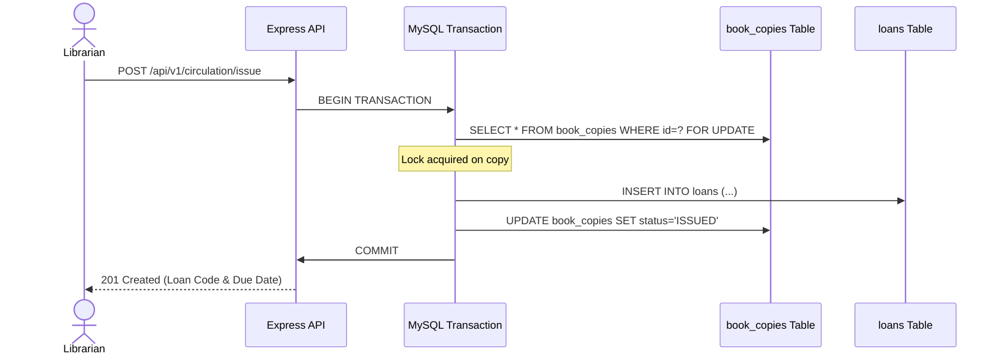

# LibraFlow Application Architecture

LibraFlow is built with a decoupled client-server architecture designed for reliability, strict financial precision, and concurrent transaction safety.

## 1. High-Level Architecture Overview

## 2. Request Lifecycle & Business Safety

1. **Authentication Flow**:
   - Clients send credentials to `/api/v1/auth/login`.
   - The server verifies passwords using `bcrypt` and returns signed JWT access tokens containing user role, customer ID, and expiration claims.
   - For protected endpoints, the `authenticate` middleware decodes tokens and prevents unauthorized role elevation.

2. **Circulation Workflow (Issue / Return)**:
   - All critical circulation actions execute inside `withTransaction()` with row-level locks (`SELECT ... FOR UPDATE`).
   - Prevents race conditions such as duplicate issue attempts on the same physical copy.

