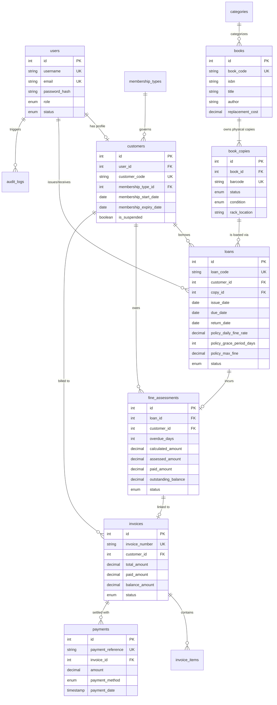

# Database Schema & Entity Relationship Documentation

LibraFlow relies on a relational database (Aiven Cloud MySQL 8.0) using the InnoDB storage engine for ACID compliance, referential integrity, and row-level locking.

## 1. Entity-Relationship Diagram (Mermaid)

## 2. Table Specifications and Keys

- **users**: Master account store supporting `ADMIN`, `LIBRARIAN`, and `CUSTOMER` roles. Passwords hashed using bcrypt.
- **membership_types**: Configurable subscription tiers specifying maximum borrow count, standard loan duration, grace period, and daily fine rates.
- **customers**: One-to-one extension of customer users, enforcing expiry dates and suspension flags.
- **books**: Catalog titles containing metadata, ISBN, and standard replacement cost.
- **book_copies**: Physical inventory tracking barcodes, condition, rack locations, and circulation availability.
- **loans**: Immutable circulation tracking. Stores issue-time snapshots of policy rates (`policy_daily_fine_rate`, `policy_grace_period_days`, `policy_max_fine`) so subsequent policy changes never retroactively corrupt past loans.
- **fine_assessments & invoices**: Financial records for overdue fees, lost book replacements, and itemized billing.
- **payments**: Immutable transaction receipts supporting cash, UPI, cards, and bank transfers.
- **audit_logs**: Immutable audit trail of actor actions, affected IDs, and event metadata.
